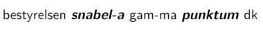

## Alumneforeningen GamMa

Velkommen til Almuneforeningen GamMas hjemmeside. GamMa er en alumneforening for **Gam**le **Ma**tematikere, der har en akademisk grad fra Institut for Matematise Fag, Københavns Universitet.

Vi er i færd med at omlægge vores hjemmeside, og denne side er derfor kun midlertidig.

### Medlemskab

Hvis du ønsker at blive medlem af GamMa foregår det ved først at udfylde denne formular: **[Bliv medlem](https://docs.google.com/forms/d/e/1FAIpQLSfYyFzM_6uXeDLiScSeR8CdiAP_QSb6BnYEojyvkU-Cj-LGGA/viewform?usp=sf_link)**.

Du skal dernæst tage kontakt til GamMas bestyrelse via den mail, du modtager ovenpå udfyldelse af formularen. Generalforsamlingen fastsatte september 2020 årets kontingent til at være 100 kroner for dimittender og 0 kroner for kandidatstuderende.

### Facebook
GamMa er tilstede på Facebook via denne Facebook-gruppe, som vi opfordrer medlemmer til at benytte og engagere sig i: **[Facebook](https://www.facebook.com/groups/gammamath/)**.

### Vedtægter
Du kan finde GamMas vedtægter her: **[Vedtægter](vedtaegter-gamma.pdf)**.

### Kontakt
Hvis du vil i kontakt med GamMas bestyrelse kan det foregå ved at skrive til:

